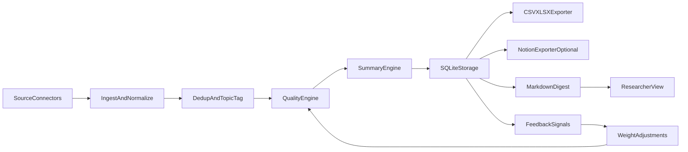

# Paper Reading Assistant

Hybrid paper tracking bot for LLM `reasoning / agent / post-training / RL`.

## Project Status

This repository already implements an end-to-end MVP based on the plan:

- Source ingestion from `arXiv`, `OpenReview`, `Semantic Scholar`, and `Papers With Code`
- Deduplication (`paper_id`/URL identity + near-duplicate title similarity)
- Topic tagging for `reasoning`, `agent`, `post_training`, `rl`
- Multi-signal quality scoring with confidence levels and explainable selection reasons
- Structured summary generation (template mode by default, API mode optional)
- Persistence in SQLite
- Export to `CSV/XLSX`, optional sync to Notion, and markdown digest generation
- Feedback loop (`like/dislike`) that adjusts scoring weights over time

## Architecture



### Runtime Steps

1. Collect paper candidates from enabled sources.
2. Normalize all sources into a shared `Paper` schema.
3. Remove exact and near-duplicate records.
4. Tag papers into `reasoning`, `agent`, `post_training`, `rl`.
5. Score with multi-signal quality metrics and confidence levels.
6. Generate structured summaries and risk notes.
7. Persist all records, export top picks, and produce digest output.
8. Consume user feedback to adjust future scoring weights.

## Data Schema

### `papers` table (SQLite)

| Field | Type | Description |
|---|---|---|
| `paper_id` | `TEXT (PK)` | Stable identity key for upsert and dedup. |
| `source` | `TEXT` | Source name (`arxiv`, `openreview`, etc.). |
| `title` | `TEXT` | Paper title. |
| `abstract` | `TEXT` | Paper abstract/body snippet used by scoring/summary. |
| `url` | `TEXT` | Canonical paper URL. |
| `published_at` | `TEXT` | ISO timestamp when available. |
| `authors_json` | `TEXT` | JSON array of authors. |
| `orgs_json` | `TEXT` | JSON array of institutions/organizations. |
| `venue` | `TEXT` | Venue string for venue-quality signal. |
| `topics_json` | `TEXT` | JSON array of matched topics. |
| `code_url` | `TEXT` | Code repository URL if available. |
| `citation_count` | `INTEGER` | Citation-based impact signal. |
| `social_signal` | `REAL` | Early attention signal (normalized score). |
| `metadata_json` | `TEXT` | Raw extra source metadata. |
| `final_score` | `REAL` | Combined quality score in `[0, 1]`. |
| `confidence` | `TEXT` | Confidence bucket (`A`, `B`, `C`). |
| `score_breakdown_json` | `TEXT` | JSON detail of each score dimension. |
| `why_selected` | `TEXT` | Human-readable recommendation rationale. |
| `risk_flags_json` | `TEXT` | JSON list of risk flags. |
| `summary` | `TEXT` | Structured summary content. |
| `pushed` | `INTEGER` | Delivery state (`0` not pushed, `1` pushed). |

### `feedback` table (SQLite)

| Field | Type | Description |
|---|---|---|
| `id` | `INTEGER (PK)` | Auto-increment feedback row ID. |
| `paper_id` | `TEXT` | Target paper identifier. |
| `signal` | `TEXT` | Feedback channel (`topic_like`, `venue_like`, etc.). |
| `value` | `INTEGER` | Feedback value in `{-1, 0, 1}`. |
| `created_at` | `TEXT` | Feedback timestamp (UTC ISO string). |

### Recommendation Output Schema (`CSV/XLSX` and Notion mapping)

| Field | Description |
|---|---|
| `title` | Paper title |
| `url` | Paper link |
| `date` | Publication date |
| `topics` | Matched topic tags |
| `venue` | Venue/journal/conference |
| `authors` | Author list |
| `org` | Organization list |
| `score` | Final score |
| `confidence` | Confidence tier |
| `summary` | Structured summary |
| `risks` | Risk flags |
| `code_url` | Code repository URL |
| `read_status` | Manual reading state (default `new`) |
| `why_selected` | Explainable recommendation reason |

## What We Built

### 1) Source Connectors and Ingestion Pipeline

Implemented connectors:

- `src/paper_bot/connectors/arxiv.py`
- `src/paper_bot/connectors/openreview.py`
- `src/paper_bot/connectors/semantic_scholar.py`
- `src/paper_bot/connectors/papers_with_code.py`
- `src/paper_bot/connectors/registry.py` (orchestrates all connectors)

Pipeline flow:

1. Fetch candidate papers from enabled sources
2. Normalize metadata into a shared `Paper` model
3. Deduplicate by identity key and title similarity
4. Tag topics based on configured taxonomy

Relevant files:

- `src/paper_bot/models/paper.py`
- `src/paper_bot/pipeline/ingest.py`
- `src/paper_bot/topic_taxonomy.py`
- `src/paper_bot/utils/text.py`

### 2) Quality Engine (Beyond Semantic Similarity)

Implemented in `src/paper_bot/pipeline/quality.py`.

Scoring dimensions:

- `topic_fit`
- `venue_signal`
- `author_org_signal`
- `impact_signal`
- `method_novelty`
- `evidence_strength`

Outputs per paper:

- `final_score` in `[0, 1]`
- `confidence` (`A/B/C`)
- `risk_flags` (e.g., weak evidence or hype mismatch)
- `why_selected` (human-readable explanation)

### 3) Summary Engine and Risk-Aware Reporting

Implemented in `src/paper_bot/pipeline/summary.py`.

Two modes:

- `local_template` (default): no API key required
- `api`: model-based summarization via OpenAI-compatible endpoint

Summary structure is aligned with research use:

- Problem
- Core idea / method
- Key result signal
- Relation to your target research tracks
- Reviewer-style risk notes
- Reproducibility suggestion

### 4) Storage, Export, and Push

Storage:

- `src/paper_bot/storage/sqlite_store.py`
- SQLite tables for `papers` and `feedback`

Export:

- `src/paper_bot/exporters/sheet_exporter.py` -> `data/recommendations.csv` + `data/recommendations.xlsx`
- `src/paper_bot/exporters/notion_exporter.py` -> optional Notion database sync

Push:

- `src/paper_bot/pipeline/push.py` -> `data/daily_digest.md`

### 5) Feedback Loop and Iteration

Feedback and weight adaptation are implemented:

- `src/paper_bot/pipeline/feedback.py`
- `topic_like`, `venue_like`, `author_org_like`, etc. are aggregated from SQLite feedback
- Small, stable weight adjustments are applied in subsequent scoring runs

### 6) End-to-End Bot Orchestration and CLI

Main orchestrator:

- `src/paper_bot/pipeline/bot.py`

CLI entry:

- `src/paper_bot/cli.py`

Supported commands:

- Run one full cycle: fetch -> dedup -> score -> summarize -> persist -> export -> push
- Submit feedback for online iteration

## Quickstart

1. Install:

```bash
python -m venv .venv
.venv\Scripts\activate
pip install -e .
```

2. Configure:

- Edit `config/bot_config.yaml`
- Optional: set `OPENAI_API_KEY` and `NOTION_API_KEY`
- Optional: enable `export.notion.enabled` and fill `database_id`

3. Run one full cycle:

```bash
paper-bot-run --config config/bot_config.yaml run
```

4. Submit feedback (for iterative quality tuning):

```bash
paper-bot-run --config config/bot_config.yaml feedback --paper-id "<id>" --signal topic_like --value 1
```

## Runtime Outputs

- `data/papers.db`: persistent paper store + score + summary + push state + feedback
- `data/recommendations.csv`: tabular recommendations for spreadsheet workflows
- `data/recommendations.xlsx`: Excel workbook for local/offline use
- `data/daily_digest.md`: generated digest for daily push/report

## Outputs

- `data/papers.db`: full storage with scores/summaries.
- `data/recommendations.csv`: recommendation sheet.
- `data/recommendations.xlsx`: recommendation workbook.
- `data/daily_digest.md`: daily push digest.

## Configuration Highlights

- `config/bot_config.yaml` controls:
  - source enable/disable and limits
  - topic taxonomy aliases
  - scoring weights
  - summary provider/model
  - export destinations
  - push settings

## Current Known Limitations

- External APIs may return `403`/`429` depending on rate limit or access policy.
- Some connectors may need source-specific retry/backoff/auth tuning for production.
- Quality signals are currently heuristic-based and should be calibrated with user feedback.

## Next Recommended Improvements

- Add robust retry/backoff and source-specific throttling in connectors.
- Add weekly thematic digest (`reasoning/agent/post-training/rl` balanced picks).
- Add stronger venue/author authority tables and citation velocity tracking.
- Add richer observability (ingest counts, dedup ratio, recommendation hit-rate).
